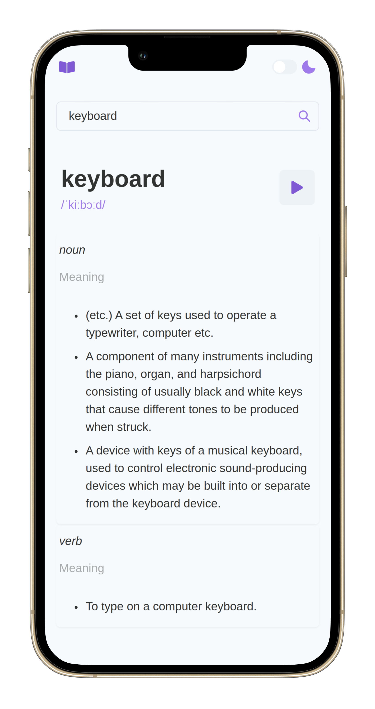

<br/>
<p align="center">
  <a href="https://github.com/ayequill/dictionary">
    
  </a>

  <h3 align="center">Dictionary Webapp</h3>

  <p align="center">
    This is a simple dictionary webapp developed with React and Chakra UI. Users can search for words and get their definitions and synonyms.
    <br/>
    <br/>
    <a href="https://github.com/ayequill/dictionary"><strong>Explore the docs »</strong></a>
    <br/>
    <br/>
    <a href="https://github.com/ayequill/dictionary">View Demo</a>
    .
    <a href="https://github.com/ayequill/dictionary/issues">Report Bug</a>
    .
    <a href="https://github.com/ayequill/dictionary/issues">Request Feature</a>
  </p>
</p>

     

## Table Of Contents

* [About the Project](#about-the-project)
* [Built With](#built-with)
* [Getting Started](#getting-started)
  * [Prerequisites](#prerequisites)
  * [Installation](#installation)
* [Usage](#usage)
* [Roadmap](#roadmap)
* [Contributing](#contributing)
* [License](#license)
* [Authors](#authors)
* [Acknowledgements](#acknowledgements)

## About The Project


The Dictionary Web App is a user-friendly online dictionary that provides users with definitions and synonyms for any English language word. The web app is built using React and a REST API to allow users to search for any word and get quick access to its meaning and synonyms.

## Built With

The Dictionary Web App was built using the following technologies:

- React: A JavaScript library for building user interfaces.
- REST API: A RESTful API to provide data for the web app.
- Chakra UI: A React component library for building responsive and -accessible user interfaces.

## Getting Started


### Prerequisites

* npm

```sh
npm install npm@latest -g
```

### Installation

## Run Locally

Clone the project

```bash
  git clone https://github.com/ayequill/dictionary.git
```

Go to the project directory

```bash
  cd dictionary
```

Install dependencies

```bash
  npm install
```

Start the server

```bash
  npm run dev
```

## Usage

- Enter a word in the search bar and click "Search".
- The app will display the definition and synonyms of the word, if available.
- To search for another word, simply enter a new word in the search bar and click "Search".
space. You may also link to more resources.

## Roadmap

See the [open issues](https://github.com/ayequill/dictionary/issues) for a list of proposed features (and known issues).

## Contributing

Contributions are what make the open source community such an amazing place to be learn, inspire, and create. Any contributions you make are **greatly appreciated**.
* If you have suggestions for adding or removing projects, feel free to [open an issue](https://github.com/ayequill/dictionary/issues/new) to discuss it, or directly create a pull request after you edit the *README.md* file with necessary changes.
* Please make sure you check your spelling and grammar.
* Create individual PR for each suggestion.
* Please also read through the [Code Of Conduct](https://github.com/ayequill/dictionary/blob/main/CODE_OF_CONDUCT.md) before posting your first idea as well.

### Creating A Pull Request

1. Fork the Project
2. Create your Feature Branch (`git checkout -b feature/AmazingFeature`)
3. Commit your Changes (`git commit -m 'Add some AmazingFeature'`)
4. Push to the Branch (`git push origin feature/AmazingFeature`)
5. Open a Pull Request

## License

Distributed under the MIT License. See [LICENSE](https://github.com/ayequill/dictionary/blob/main/LICENSE.md) for more information.

## Authors

* **Siaw Nicholas** - *Developer* - [Siaw Nicholas](https://github.com/ayequill) - *-*
